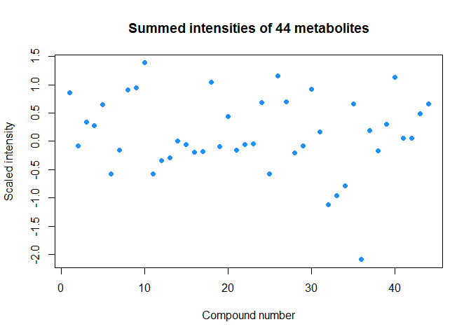
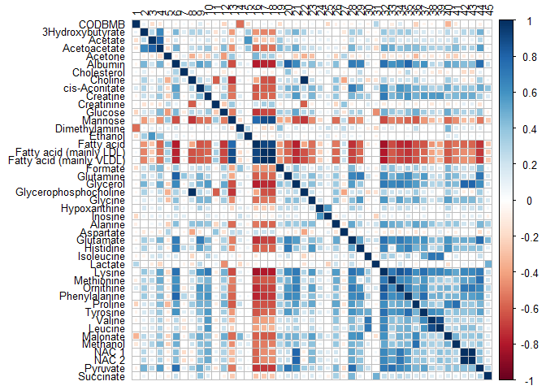
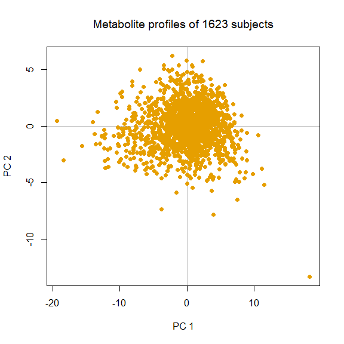
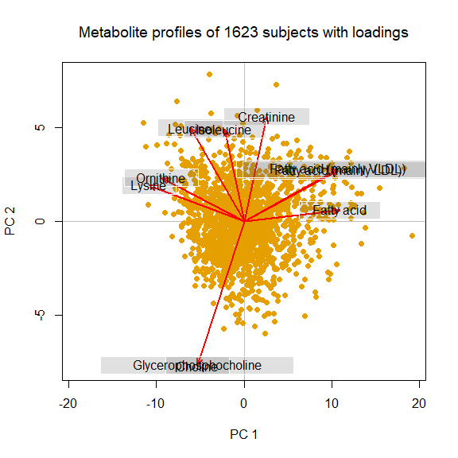

Lifepath NMR metabolomics analysis
================

Exploratory analysis
--------------------

Read in metabolomics data from text file. There are 44 compounds measured for 1623 subjects, and subject identifiers in the first column, `CODBMB`.

``` r
library(tidyverse)
ints <- read_tsv("1507_XMetabolite_std_cpmg_E3N.txt")
dim(ints)
```

    ## [1] 1623   45

``` r
colnames(ints)
```

    ##  [1] "CODBMB"                   "3Hydroxybutyrate"        
    ##  [3] "Acetate"                  "Acetoacetate"            
    ##  [5] "Acetone"                  "Albumin"                 
    ##  [7] "Cholesterol"              "Choline"                 
    ##  [9] "cis-Aconitate"            "Creatine"                
    ## [11] "Creatinine"               "Glucose"                 
    ## [13] "Mannose"                  "Dimethylamine"           
    ## [15] "Ethanol"                  "Fatty acid"              
    ## [17] "Fatty acid (mainly LDL)"  "Fatty acid (mainly VLDL)"
    ## [19] "Formate"                  "Glutamine"               
    ## [21] "Glycerol"                 "Glycerophosphocholine"   
    ## [23] "Glycine"                  "Hypoxanthine"            
    ## [25] "Inosine"                  "Alanine"                 
    ## [27] "Aspartate"                "Glutamate"               
    ## [29] "Histidine"                "Isoleucine"              
    ## [31] "Lactate"                  "Lysine"                  
    ## [33] "Methionine"               "Ornithine"               
    ## [35] "Phenylalanine"            "Proline"                 
    ## [37] "Tyrosine"                 "Valine"                  
    ## [39] "Leucine"                  "Malonate"                
    ## [41] "Methanol"                 "NAC 1"                   
    ## [43] "NAC 2"                    "Pyruvate"                
    ## [45] "Succinate"

It is useful to preview the metabolomics data.

``` r
library(knitr)
kable(ints[1:5, 1:10], caption = "Preview of the metabolomics data.")
```

|    CODBMB|  3Hydroxybutyrate|     Acetate|  Acetoacetate|     Acetone|     Albumin|  Cholesterol|     Choline|  cis-Aconitate|    Creatine|
|---------:|-----------------:|-----------:|-------------:|-----------:|-----------:|------------:|-----------:|--------------:|-----------:|
|  11091606|        -0.9156109|   0.5779014|    -0.2022630|   0.4908649|  -0.7957576|   -0.5941070|   0.4695364|     -0.6115322|  -0.3046721|
|  11102513|        -0.0815741|  -0.4824284|    -0.4308603|  -0.4714970|  -0.6462590|   -1.5475994|  -1.4772020|     -0.1711129|  -0.2186251|
|  11048476|        -0.7071017|  -0.3987182|    -0.6213580|  -0.0694977|  -0.7210083|   -0.4429435|  -1.2927741|     -0.2740681|  -0.1325781|
|  11059124|         0.0748078|   0.1035433|     0.8835738|   0.1863200|   1.8802665|   -1.3731801|  -1.8460577|      3.2607253|   1.5883620|
|  11102399|        -1.1970983|  -0.3708147|    -0.2213128|   0.1497746|  -0.4668608|   -1.3499242|  -0.5243247|      0.0004790|   0.3406805|

Intensity data are both positive and negative and most values in between -2 and 2. Data appear to be scaled and centered. We can plot the total intensity of each metabolite, being sure first to remove the ID column:

``` r
plot(colSums(ints[ , -1]), xlab = "Compound number", ylab = "Scaled intensity",
     pch = 19, col = "dodgerblue", main = "Summed intensities of 44 metabolites")
```



*Summed intensities of 44 serum metabolites measured by NMR.*

Total intensities are similar between compounds and normally distributed.We can now look at correlations between compounds:

``` r
cormat <- cor(ints)
colnames(cormat) <- NULL
library(corrplot)
corrplot(cormat, method = "square", tl.col = "black", tl.cex = 0.8)
```



*Inter-compound correlations.*

Of note is that the three fatty acid variables are correlated, as well as valine and leucine and NAC1 and NAC2. Next we can plot a PCA of the compound profiles:

``` r
ints <- ints[ , -1]
pca <- prcomp(ints, scale.=F)
library(pca3d)
pca2d(pca, title = "Metabolite profiles of 1623 subjects", xlab = "Score on PC1", ylab = "Score on PC2")
box(which = "plot", lty = "solid")
```



*Scores plot of metabolic profiles of 1623 subjects in the Lifepath study.*

There is one notable outlying profile in the bottom right-hand corner of the plot. This could be caused by a technical issue with the sample. We can find the identity of this, remove it from the dataset and rerun the PCA. The biplot shows us the variables most strongly loading onto PC1 and PC2.

There are no obvious batch effects or patterns in the data.

``` r
which(pca$x[, 2] < -10)
```

    ## [1] 1409

``` r
pca1 <- prcomp(ints[-1409, -1], scale.=F)
pca2d(pca1, title = "Metabolite profiles of 1623 subjects", xlab = "Score on PC1", ylab = "Score on PC2",
      biplot = T)
box(which = "plot", lty = "solid")
```



*Biplot of metabolic profiles in the Lifepath study (n = 1622).*

PC1 is characterised by relative concentrations of fatty acid, lysine and ornithine. PC2 is characterised by relative concentrations of creatinine, isoleucine and glycerophosphocholine.

Baseline characteristics of participants
----------------------------------------

Lifepath is a breast cancer case-control study.The following table shows baseline characteristics for cases and controls.
