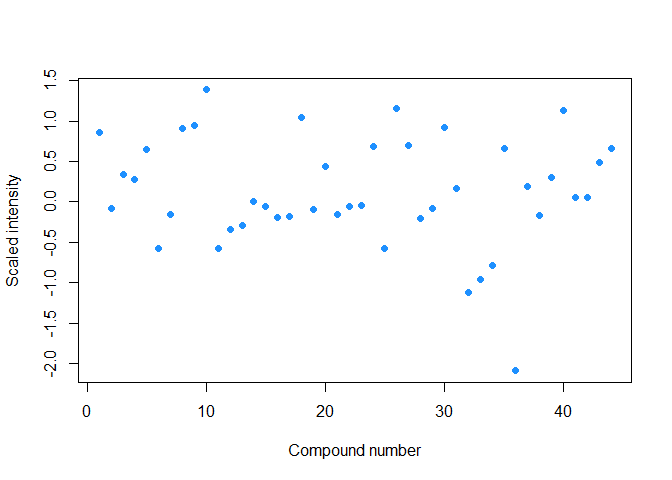
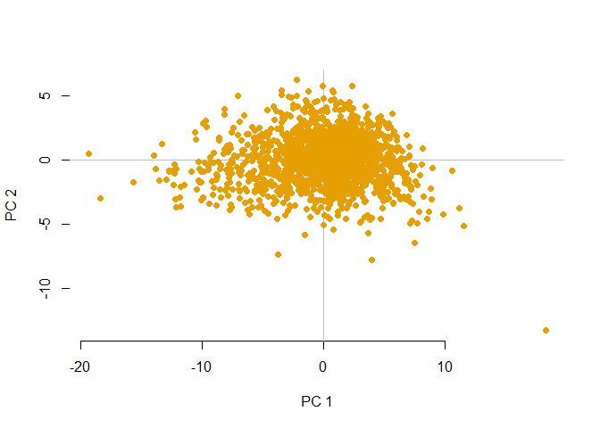

Lifepath NMR metabolomics analysis
================

Exploratory analysis
--------------------

Read in metabolomics data from text file. There are 44 compounds measured for 1623 subjects, and subject identifiers in the first column, `CODBMB`.

``` r
library(tidyverse)
ints <- read_tsv("1507_XMetabolite_std_cpmg_E3N.txt")
dim(ints)
```

    ## [1] 1623   45

``` r
head(ints)
```

    ## # A tibble: 6 x 45
    ##   CODBMB `3Hydroxybutyra~ Acetate Acetoacetate Acetone Albumin Cholesterol
    ##    <dbl>            <dbl>   <dbl>        <dbl>   <dbl>   <dbl>       <dbl>
    ## 1 1.11e7          -0.916   0.578        -0.202  0.491   -0.796      -0.594
    ## 2 1.11e7          -0.0816 -0.482        -0.431 -0.471   -0.646      -1.55 
    ## 3 1.10e7          -0.707  -0.399        -0.621 -0.0695  -0.721      -0.443
    ## 4 1.11e7           0.0748  0.104         0.884  0.186    1.88       -1.37 
    ## 5 1.11e7          -1.20   -0.371        -0.221  0.150   -0.467      -1.35 
    ## 6 1.11e7          -0.0294 -0.0639        0.293 -0.703    0.400       0.755
    ## # ... with 38 more variables: Choline <dbl>, `cis-Aconitate` <dbl>,
    ## #   Creatine <dbl>, Creatinine <dbl>, Glucose <dbl>, Mannose <dbl>,
    ## #   Dimethylamine <dbl>, Ethanol <dbl>, `Fatty acid` <dbl>, `Fatty acid
    ## #   (mainly LDL)` <dbl>, `Fatty acid (mainly VLDL)` <dbl>, Formate <dbl>,
    ## #   Glutamine <dbl>, Glycerol <dbl>, Glycerophosphocholine <dbl>,
    ## #   Glycine <dbl>, Hypoxanthine <dbl>, Inosine <dbl>, Alanine <dbl>,
    ## #   Aspartate <dbl>, Glutamate <dbl>, Histidine <dbl>, Isoleucine <dbl>,
    ## #   Lactate <dbl>, Lysine <dbl>, Methionine <dbl>, Ornithine <dbl>,
    ## #   Phenylalanine <dbl>, Proline <dbl>, Tyrosine <dbl>, Valine <dbl>,
    ## #   Leucine <dbl>, Malonate <dbl>, Methanol <dbl>, `NAC 1` <dbl>, `NAC
    ## #   2` <dbl>, Pyruvate <dbl>, Succinate <dbl>

Intensity data are both positive and negative and most values in between -2 and 2. Data appear to be scaled and centered. We can plot the total intensity of each metabolite:

``` r
plot(colSums(ints[ , -1]), xlab = "Compound number", ylab = "Scaled intensity",
     pch = 19, col = "dodgerblue")
```



Total intensities are similar between compounds and normally distributed.We can now look at correlations between compounds:

``` r
cormat <- cor(ints)
colnames(cormat) <- NULL
library(corrplot)
```

    ## Warning: package 'corrplot' was built under R version 3.5.3

    ## corrplot 0.84 loaded

``` r
corrplot(cormat, method = "square", tl.col = "black")
```


Of note is that the three fatty acid variables are correlated, as well as valine and leucine and NAC1 and NAC2. Next we can plot a PCA of the compound profiles:

``` r
ints <- ints[ , -1]
pca <- prcomp(ints, scale.=F)
library(pca3d)
```

    ## Warning: package 'pca3d' was built under R version 3.5.3

``` r
pca2d(pca, title = "Metabolite profiles of 1623 subjects", xlab = "Score on PC1", ylab = "Score on PC2")
```



There is one notable outlying profile in the bottom right-hand corner of the plot. This could be caused by a technical issue with the sample.
